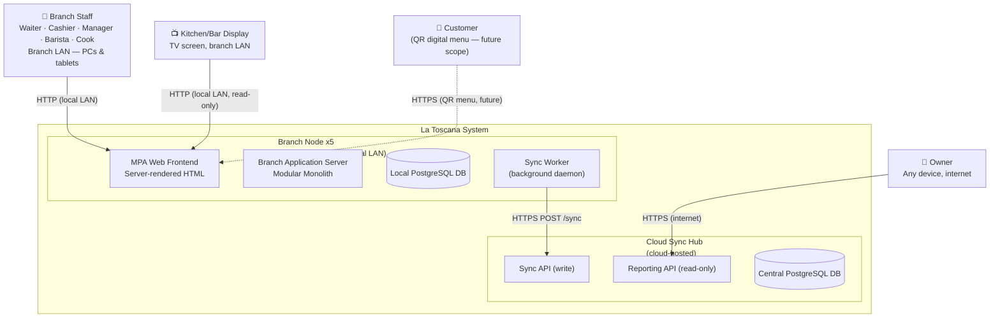
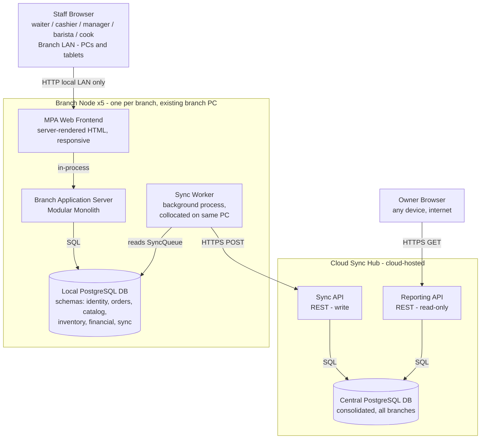
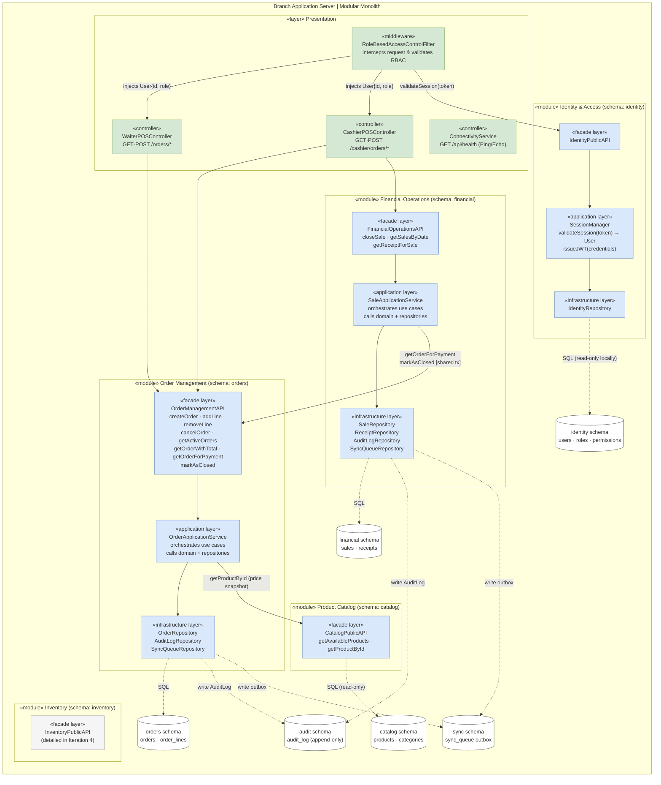
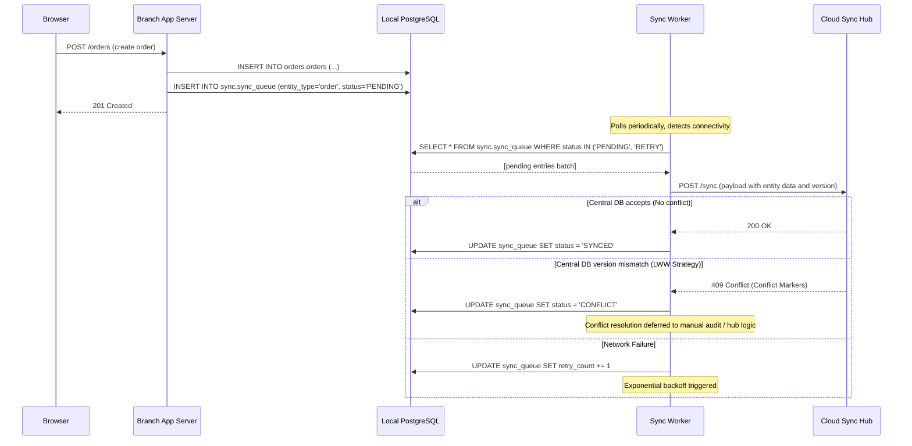
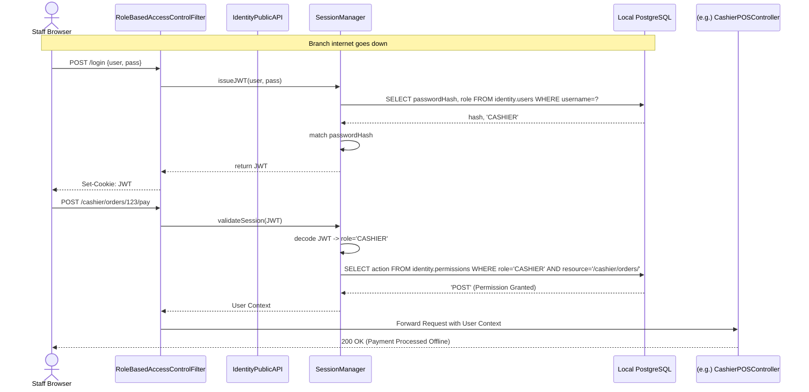
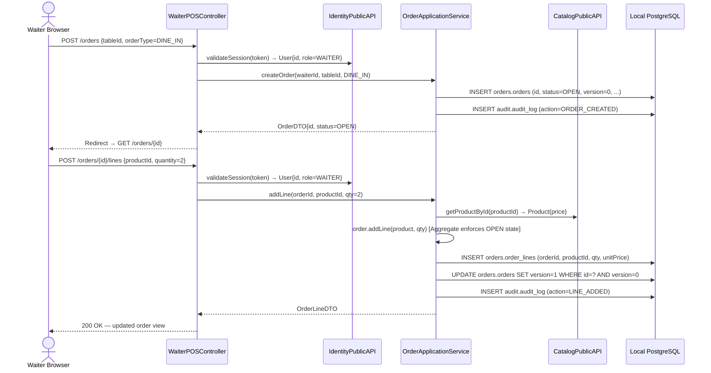
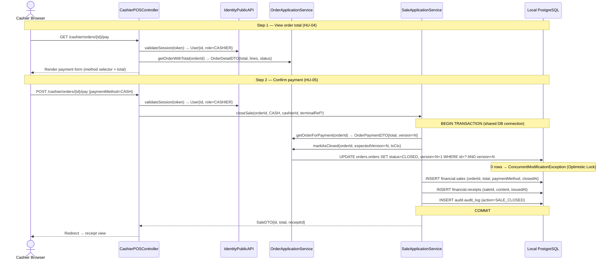

### 1.- Introduction

This document is the living **Architecture Specification** for **La Toscana**, a point-of-sale and franchise-management system designed for a chain of five coffee-shop branches located in Iztapalapa, Chalco, Amecameca, Yecapixtla and Cuautla, Mexico. The system was designed following the **Attribute-Driven Design (ADD) 3.0** process, which produces the architecture through a series of structured iterations, each one refining a subset of the system driven by a prioritized set of architectural drivers.

The main business motivation is to eliminate the estimated **$33,000–$58,000 MXN/month** in losses caused by unregistered orders, manual cash-register errors, inventory waste, and lack of centralized visibility for the owner. Three of the five branches have intermittent internet connectivity, which makes **offline-first operation** a hard constraint rather than a nice-to-have feature.

This document consolidates the outputs of all completed ADD iterations:

| Section | Content |
|---|---|
| **1. Introduction** | Purpose, scope, and structure of this document. |
| **2. Context Diagram** | External actors and system boundary. |
| **3. Architectural Drivers** | Prioritized user stories, quality-attribute scenarios, constraints, and concerns. |
| **4. Domain Model** | Core business concepts and their relationships (bounded-context level). |
| **5. Container Diagram** | Top-level deployment units: Branch Nodes and Cloud Sync Hub. |
| **6. Component Diagrams** | Internal structure of each container, including zoom-in views from each iteration. |
| **7. Sequence Diagrams** | Interaction traces for the most architecturally significant user stories. |
| **8. Interfaces** | Public API contracts defined for each module facade. |
| **9. Design Decisions** | Rationale table for every decision made across all iterations. |

---

### 2.- Context diagram

This diagram shows the **system boundary** of the La Toscana system and all external actors that interact with it. There are two distinct deployment contexts: the **Branch Node** (one per branch, running on the existing branch PC on the local LAN) and the **Cloud Sync Hub** (a cloud-hosted service for cross-branch data aggregation and owner reporting). Actors access only the context that corresponds to their role: branch staff interact exclusively with the Branch Node over the local network, the owner accesses the Cloud Sync Hub over the internet, and the Sync Worker is an internal background process that bridges both contexts.

> **Actor access rules:** Branch staff and kitchen displays interact exclusively with the Branch Node over the local LAN — they have no direct access to the Cloud Sync Hub. The owner accesses only the Reporting API on the Cloud Sync Hub over the internet. The Sync Worker is an internal actor; it has no user-facing interface.

---

### 3.- Architectural drivers

The following tables summarize all drivers extracted from `ArchitecturalDrivers.md` and used to guide architecture decisions across all iterations. Drivers are ordered by priority within each category.

#### 3.1 — User Stories

| ID | Description | Priority |
|---|---|---|
| HU-01 | Waiter registers customer orders from a tablet using the digital catalog. | 🔴 Alta |
| HU-02 | Order is automatically sent to the kitchen/bar screen upon confirmation. | 🔴 Alta |
| HU-03 | Waiter receives a notification when a product is ready at the bar/kitchen. | 🟡 Media |
| HU-04 | Cashier consults active orders per table with auto-calculated totals. | 🔴 Alta |
| HU-05 | Cashier records payment method (cash or card) and generates a receipt. | 🔴 Alta |
| HU-06 | Cashier registers direct (take-away) sales in the system. | 🔴 Alta |
| HU-07 | Barista/cook views pending orders by priority on a screen. | 🟡 Media |
| HU-08 | Barista/cook consults the standardized recipe for each product. | 🟠 Baja |
| HU-09 | Barista/cook marks products as "ready" to auto-notify the waiter. | 🟡 Media |
| HU-10 | Branch manager runs the daily cash-register cut with auto-calculated totals. | 🔴 Alta |
| HU-11 | Branch manager compares physical cash vs. system expected amount. | 🔴 Alta |
| HU-12 | Branch manager consults real-time ingredient stock levels. | 🔴 Alta |
| HU-13 | Branch manager receives automatic alerts when an ingredient reaches minimum stock. | 🔴 Alta |
| HU-14 | Branch manager records waste and inventory adjustments with justification. | 🔴 Alta |
| HU-15 | Owner views a KPI dashboard for sales, inventory, and financials across all branches. | 🟡 Media |
| HU-16 | Owner filters reports by branch, date range, and product category. | 🟡 Media |
| HU-17 | Owner/accountant exports financial reports in PDF and Excel format. | 🟡 Media |
| HU-18 | Owner manages the centralized product catalog (prices, descriptions, photos). | 🟡 Media |
| HU-19 | Owner/manager maintains a supplier catalog with contact and pricing history. | 🟡 Media |
| HU-20 | Manager generates purchase orders and records ingredient receipt. | 🟡 Media |
| HU-21 | Owner/manager registers standardized recipes linked to inventory deductions. | 🟠 Baja |
| HU-22 | Customer views the digital menu by scanning a QR code. | 🟡 Media |
| HU-23 | Customer filters the digital menu by product category. | 🟡 Media |
| HU-24 | Owner/manager creates and schedules time-bound promotions. | 🟠 Baja |
| HU-25 | Owner consults the sales impact of each promotion. | 🟠 Baja |
| HU-26 | Cashier registers basic customer data for future loyalty programs. | 🟠 Baja |
| HU-27 | System operates in offline mode and auto-syncs when connectivity is restored. | 🔴 Alta |
| HU-28 | System enforces differentiated roles and permissions for 6 distinct roles. | 🔴 Alta |

#### 3.2 — Quality Attribute Scenarios

| ID | Attribute | Scenario | Business Importance | Technical Difficulty | Priority |
|---|---|---|---|---|---|
| QA-PERF-01 | Performance | Waiter confirms a 5-product order; system registers it in kitchen/bar ≤ 2 s. | High | Medium | **Medium** |
| QA-PERF-02 | Performance | Manager requests the daily cash-register cut; system returns the summary ≤ 5 s. | Medium | High | **Medium** |
| QA-PERF-03 | Performance | Waiter searches for a product by partial name; results appear ≤ 1 s per keystroke. | Medium | Low | **Low** |
| QA-SEC-01 | Security | Waiter tries to access financial reports; system blocks access and logs the attempt ≤ 1 s. | High | Low | **Medium** |
| QA-SEC-02 | Security | Cashier tries to modify a closed order; system prevents it, requires manager auth, and traces the event. | High | Medium | **Medium** |
| QA-SEC-03 | Security | Cashier leaves POS unattended; system auto-closes session ≤ 10 min and requires re-authentication. | Medium | Medium | **Medium** |
| QA-USA-01 | Usability | New untrained waiter registers their first order on the tablet ≤ 3 min. | High | Medium | **Medium** |
| QA-USA-02 | Usability | Customer scans QR menu and finds a product with price ≤ 30 s; satisfaction ≥ 4/5. | Medium | Low | **Low** |
| QA-USA-03 | Usability | Cashier selects wrong payment method; can correct it ≤ 2 steps without data loss. | High | Low | **Medium** |
| QA-AVA-01 | Availability | All 5 branches access the system simultaneously during business hours; uptime ≥ 99.5 % monthly. | High | Medium | **Medium** |
| QA-AVA-02 | Availability | Cloud server fails during peak hours; branches continue offline; service restored ≤ 15 min, 0 data loss. | High | High | **High** |
| QA-AVA-03 | Availability | Team deploys a planned update; system applies it with 0 min downtime during business hours. | Low | High | **Low** |
| QA-REL-01 | Reliability | A branch loses internet for 2 hours, registers 40 offline orders, then syncs 100 % without loss or duplicates. | High | High | **High** |
| QA-REL-02 | Reliability | Two cashiers process concurrent transactions; system maintains referential integrity and inventory consistency. | High | Medium | **Medium** |
| QA-REL-03 | Reliability | Three branches reconnect at different times after offline operation; system consolidates 100 % of transactions. | High | High | **High** |
| QA-MOD-01 | Modifiability | Owner requests a new loyalty module; team implements, tests, and deploys it ≤ 2 sprints with 0 regressions. | Medium | Medium | **Medium** |
| QA-MOD-02 | Modifiability | Franchise opens a sixth branch; system is configured and operational ≤ 1 business day. | Medium | Low | **Low** |
| QA-MOD-03 | Modifiability | Owner requests new conditional promotion rules; team implements them ≤ 1 sprint without touching unaffected modules. | Low | Medium | **Low** |

#### 3.3 — Constraints

| ID | Constraint | Type |
|---|---|---|
| RES-01 | System **must operate offline** and auto-sync when connectivity is restored (3 of 5 branches have intermittent internet). | 🔧 Technical |
| RES-02 | System must support up to **40 concurrent users** distributed across 5 branches (peak: 10–12 per large branch). | 🔧 Technical |
| RES-03 | UI must be **responsive** and fully functional on desktops, tablets, and smartphones. | 🔧 Technical |
| RES-04 | System must be compatible with **TV screens** for kitchen/bar preparation display. | 🔧 Technical |
| RES-05 | Digital customer menu must be a **QR-accessible web app** (no native app install). | 🔧 Technical |
| RES-06 | System must implement **differentiated role-based access** for 6 roles: owner, manager, cashier, waiter, barista, cook. | 🔧 Technical |
| RES-07 | Offline sync must use a **reliable data-conflict resolution strategy** (multiple devices per branch may generate simultaneous data). | 🔧 Technical |
| RES-08 | System must handle **700–1,100 orders/day** across the franchise (~18,200–28,600/month) without performance degradation. | 🔧 Technical |
| RES-09 | System must run on **existing infrastructure** (5 PCs, 10–14 tablets, 5 TVs, personal smartphones) with no additional hardware investment. | 🔧 Technical |

#### 3.4 — Architectural Concerns (selected high-priority)

| ID | Concern |
|---|---|
| C001.2.1 | Offline-online synchronization strategy: ensure data consistency when branches operate with intermittent connectivity and multiple devices generate simultaneous data. |
| C001.2.2 | Local data persistence: define where and how data is stored on each device while operating offline. |
| C002.1.1 | Inter-module integration: define an internal architecture with cohesive modules and low coupling. |
| C002.1.2 | Cross-module atomicity: guarantee consistency between sale recording and inventory deduction, especially offline. |
| C002.1.3 | User-story dependencies: manage technical dependencies between stories based on data or prior capabilities. |
| C003.1.1 | RBAC implementation: design robust authentication and authorization for differentiated roles without operational friction. |
| C003.1.2 | Permission granularity: define the permission matrix per role. |
| C003.1.3 | Session management: define expiration, auto-logout, and concurrency on shared devices. |
| C003.1.4 | Offline authentication: define how identity is validated without a connection to the central hub. |
| C003.3.1 | Full operation traceability: record who performed which action and when for orders, payments, inventory, and cash cuts. |
| C004.3.1 | Operational continuity on central server failure: branches must keep operating critical functions. |
| C005.1.1 | Module boundaries: delimit responsibilities for each module to enable parallel development. |
| C006.1.3 | Offline UX: communicate connectivity status, errors, and pending sync items to the staff. |
| C007.1.1 | Multi-branch data structure: support multiple branches, concurrent users, and daily order volume without degradation. |
| C007.1.2 | Isolation vs. shared data: define which data is shared and which is branch-scoped. |
### 4.- Domain model

This domain model captures the core business concepts of the **La Toscana** franchise management system.
It is derived from the functional requirements (HU-01 to HU-28), the quality attribute scenarios and the architectural constraints defined in `ArchitecturalDrivers.md`.
The model is organized around seven bounded contexts: **Identity & Access**, **Order Management**, **Product Catalog**, **Inventory**, **Financial Operations**, **Purchasing**, and **Reporting**.

```mermaid
classDiagram

    namespace IdentityAccess {
        class User {
            +String id
            +String name
            +String email
            +String passwordHash
            +login()
            +logout()
        }
        class Role {
            <<enumeration>>
            OWNER
            MANAGER
            CASHIER
            WAITER
            BARISTA
            COOK
        }
        class Permission {
            +String id
            +String resource
            +String action
        }
    }
    User "1" --> "1" Role : has
    Role "1" --> "*" Permission : grants

    namespace FranchiseBranch {
        class Franchise {
            +String id
            +String name
        }
        class Sucursal {
            +String id
            +String name
            +String location
            +Boolean onlineStatus
        }
    }
    Franchise "1" --> "1..*" Sucursal : operates
    User "*" --> "1" Sucursal : belongs to

    namespace ProductCatalog {
        class Product {
            +String id
            +String name
            +String description
            +Decimal price
            +String photoUrl
            +Boolean available
        }
        class Category {
            +String id
            +String name
        }
        class Recipe {
            +String id
            +String preparation
        }
        class RecipeLine {
            +Decimal quantity
            +String unit
        }
        class Ingredient {
            +String id
            +String name
            +String unit
        }
    }
    Product "*" --> "1" Category : belongs to
    Product "1" --> "0..1" Recipe : defined by
    Recipe "1" *-- "*" RecipeLine : composed of
    RecipeLine "*" --> "1" Ingredient : uses

    namespace OrderManagement {
        class Order {
            +String id
            +DateTime createdAt
            +Decimal total
        }
        class OrderStatus {
            <<enumeration>>
            OPEN
            SENT_TO_KITCHEN
            READY
            CLOSED
            CANCELLED
        }
        class OrderType {
            <<enumeration>>
            DINE_IN
            TAKEAWAY
        }
        class OrderLine {
            +int quantity
            +Decimal unitPrice
            +String notes
        }
        class Table {
            +String id
            +int number
        }
        class TableStatus {
            <<enumeration>>
            AVAILABLE
            OCCUPIED
        }
    }
    Order "1" --> "1" OrderStatus : has
    Order "1" --> "1" OrderType : is of
    Order "1" *-- "*" OrderLine : contains
    Order "*" --> "0..1" Table : assigned to
    Table "1" --> "1" TableStatus : has
    OrderLine "*" --> "1" Product : references
    Order "*" --> "1" Sucursal : belongs to

    namespace FinancialOperations {
        class Sale {
            +String id
            +DateTime closedAt
            +Decimal total
        }
        class PaymentMethod {
            <<enumeration>>
            CASH
            CARD
        }
        class Receipt {
            +String id
            +DateTime issuedAt
            +String content
        }
        class CashRegisterCut {
            +String id
            +Date date
            +Decimal expectedAmount
            +Decimal actualAmount
            +Decimal difference
        }
        class Promotion {
            +String id
            +String name
            +String description
            +Decimal discount
            +DateTime startDate
            +DateTime endDate
            +Boolean active
        }
    }
    Sale "1" --> "1" Order : closes
    Sale "1" --> "1" PaymentMethod : paid by
    Sale "1" --> "1" Receipt : generates
    Sale "*" --> "0..1" Promotion : applies
    CashRegisterCut "*" --> "*" Sale : consolidates
    CashRegisterCut "*" --> "1" Sucursal : for

    namespace Inventory {
        class InventoryItem {
            +String id
            +Decimal stock
            +Decimal minLevel
        }
        class StockAdjustment {
            +String id
            +DateTime date
            +Decimal quantity
            +String justification
        }
        class AdjustmentReason {
            <<enumeration>>
            WASTE
            THEFT
            CORRECTION
            PURCHASE_RECEIPT
        }
        class StockAlert {
            +String id
            +DateTime triggeredAt
            +Boolean acknowledged
        }
    }
    InventoryItem "*" --> "1" Ingredient : tracks
    InventoryItem "1" *-- "*" StockAdjustment : records
    StockAdjustment "1" --> "1" AdjustmentReason : classified as
    InventoryItem "1" --> "*" StockAlert : generates
    InventoryItem "*" --> "1" Sucursal : kept at

    namespace Purchasing {
        class Supplier {
            +String id
            +String name
            +String contactInfo
        }
        class SupplierProduct {
            +Decimal price
            +String unit
        }
        class PurchaseOrder {
            +String id
            +DateTime issuedAt
            +String status
        }
        class PurchaseOrderLine {
            +Decimal quantityOrdered
            +Decimal quantityReceived
            +Decimal unitCost
        }
    }
    Supplier "1" --> "*" SupplierProduct : offers
    SupplierProduct "*" --> "1" Ingredient : corresponds to
    PurchaseOrder "1" *-- "*" PurchaseOrderLine : contains
    PurchaseOrderLine "*" --> "1" SupplierProduct : references
    PurchaseOrder "*" --> "1" Supplier : placed with
    PurchaseOrder "*" --> "1" Sucursal : delivered to

    namespace CustomerLoyalty {
        class Customer {
            +String id
            +String name
            +String contact
        }
    }
    Sale "*" --> "0..1" Customer : associated with

    namespace OfflineSync {
        class SyncQueue {
            +String id
            +String entityType
            +String entityId
            +String payload
            +DateTime queuedAt
        }
        class SyncStatus {
            <<enumeration>>
            PENDING
            SYNCED
            CONFLICT
            FAILED
        }
    }
    SyncQueue "1" --> "1" SyncStatus : has
    SyncQueue "*" --> "1" Sucursal : queued at

    namespace Audit {
        class AuditLog {
            +String id
            +DateTime timestamp
            +String entityType
            +String entityId
            +String action
        }
    }
    AuditLog "*" --> "1" User : performed by
```

#### Domain model element descriptions

| Element | Type | Description |
|---|---|---|
| **User** | Entity | Represents a system user (employee). Holds credentials and is bound to exactly one `Role` and one `Sucursal`. Supports HU-28, QA-SEC-01/02/03, RES-06. |
| **Role** | Enumeration | The six operational roles defined in RES-06: OWNER, MANAGER, CASHIER, WAITER, BARISTA, COOK. |
| **Permission** | Value Object | Defines a granular access rule (resource + action) assigned to a `Role` via RBAC (C003.1.1, C003.1.2). |
| **Franchise** | Entity | The top-level organizational unit, owning all branches of La Toscana. Supports the multi-tenant data model (C007.1.1). |
| **Sucursal** | Entity | One of the five physical branches. Tracks its own `onlineStatus` to support offline operation (HU-27, RES-01). |
| **Product** | Entity | An item available for sale. Centralizes pricing, descriptions and photos for consistency across branches (HU-18, NEC-05). |
| **Category** | Entity | Groups products for filtering in the POS and the QR digital menu (HU-22, HU-23). |
| **Recipe** | Entity | The standardized preparation procedure linked to a `Product` (HU-08, HU-21, NEC-06). |
| **RecipeLine** | Value Object | One ingredient + quantity entry within a `Recipe`. Enables automatic inventory deduction per sale. |
| **Ingredient** | Entity | A raw material tracked in inventory. Shared between `Recipe` and `InventoryItem` (NEC-01, NEC-06). |
| **Order** | Entity | A customer order linked to a table or marked as take-away. Lifecycle goes from OPEN to CLOSED (HU-01, HU-02, HU-04, HU-06). Contains full traceability. |
| **OrderStatus** | Enumeration | State machine for an order: OPEN → SENT_TO_KITCHEN → READY → CLOSED / CANCELLED. Drives kitchen display and waiter notifications (HU-07, HU-09). |
| **OrderType** | Enumeration | DINE_IN for table service, TAKEAWAY for direct sales. Covers HU-06. |
| **OrderLine** | Value Object | A single product-quantity entry within an `Order`, capturing the price at the moment of sale. |
| **Table** | Entity | Represents a physical table at a branch. Maintains AVAILABLE / OCCUPIED status to support the cashier view (HU-04). |
| **TableStatus** | Enumeration | AVAILABLE or OCCUPIED, reflecting each table's current state. |
| **Sale** | Entity | Represents a closed, paid transaction tied to an `Order`. Records the payment method and links to a `Receipt` (HU-05, NEC-03). |
| **PaymentMethod** | Enumeration | CASH or CARD payment options available at the POS (HU-05). |
| **Receipt** | Entity | The purchase proof generated at the moment of payment (HU-05, C002.3.2). |
| **CashRegisterCut** | Entity | The daily financial closing for one branch: expected vs. actual cash, automated by the system (HU-10, HU-11, NEC-03). |
| **Promotion** | Entity | A timed discount applicable to sales. Managed centrally by the owner and reflected in the QR menu (HU-24, HU-25). |
| **InventoryItem** | Entity | Tracks the current stock of one `Ingredient` at one branch. Triggers low-stock alerts (HU-12, HU-13, NEC-01). |
| **StockAdjustment** | Entity | Records a manual change to inventory stock (waste, correction, receipt), with justification for audit purposes (HU-14, C003.3.1). |
| **AdjustmentReason** | Enumeration | Classifies inventory adjustments: WASTE, THEFT, CORRECTION, PURCHASE_RECEIPT. |
| **StockAlert** | Entity | Auto-generated notification when an `InventoryItem` drops to or below its minimum level (HU-13, QA-MOD-03). |
| **Supplier** | Entity | A provider of ingredients, including contact data and historical pricing (HU-19, NEC-02). |
| **SupplierProduct** | Value Object | Associates a `Supplier` with an `Ingredient` at a specific price and unit (HU-19, HU-20). |
| **PurchaseOrder** | Entity | A formal order sent to a `Supplier`. On reception, automatically updates `InventoryItem` stock (HU-20, NEC-02). |
| **PurchaseOrderLine** | Value Object | One line (ingredient, quantity ordered, quantity received, unit cost) within a `PurchaseOrder`. |
| **Customer** | Entity | Stores basic contact data for a guest to support future loyalty programs (HU-26, NEC-09). |
| **SyncQueue** | Entity | Queues entity mutations generated while a branch is offline, to be replayed upon reconnection (HU-27, RES-01, RES-07, C001.2.1). |
| **SyncStatus** | Enumeration | Lifecycle of a queued item: PENDING → SYNCED / CONFLICT / FAILED. |
| **AuditLog** | Entity | Immutable record of every sensitive action (who, what, when) for security traceability (QA-SEC-02, C003.3.1, C003.3.2). |

### 5.- Container diagram

This diagram shows the top-level containers that compose the La Toscana system as established in Iteration 1. There are five autonomous **Branch Nodes** (one per branch), each running on the existing branch PC, and one central **Cloud Sync Hub** hosted in the cloud. Each Branch Node is fully self-contained and operational without internet access. The Cloud Sync Hub aggregates data from all branches and exposes a reporting interface exclusively to the owner.

> **Actor separation:** Staff browsers (waiters, cashiers, managers, baristas, cooks) access **only** the Branch Node MPA via local LAN — no direct access to the Cloud Sync Hub. The owner browser accesses **only** the Reporting API on the Cloud Sync Hub over the internet. Customers/diners are out of scope for this iteration (QR menu is addressed in Iteration 6).

> **Sync Worker colocation:** The Sync Worker is a background OS-level process (daemon/service) running on the **same physical branch PC** as the Branch Application Server and PostgreSQL. It is not a separate machine. It has no HTTP interface; it only reads from the local DB and pushes to the Cloud Sync Hub.

#### Container responsibilities

| Container | Who accesses it | Responsibility |
|---|---|---|
| **MPA Web Frontend** | Staff browsers — local LAN only | Serves server-rendered HTML pages to staff browsers on branch PCs and tablets. Provides role-gated sections: POS View, Kitchen Display View, Manager View. Calls the Branch Application Server in-process. |
| **Branch Application Server** | MPA Web Frontend (in-process) | Hosts the modular monolith with all branch-local business logic (Identity & Access, Order Management, Product Catalog, Inventory, Financial Operations). Each module accessed only through its Public API/Facade. |
| **Local PostgreSQL DB** | Branch App Server (SQL); Sync Worker (reads sync schema) | Persists all branch-local data using one schema per bounded-context module plus a shared `sync` schema for the SyncQueue outbox. Provides ACID guarantees for financial data integrity. |
| **Sync Worker** | Local DB (reads); Cloud Sync Hub (writes) | Background process collocated on the branch PC. Reads `PENDING` entries from `sync.sync_queue` and pushes them to the Cloud Sync Hub when internet is available. Marks entries `SYNCED`, `CONFLICT`, or `FAILED`. |
| **Sync API** | Sync Workers from all 5 branches | REST write endpoint on the Cloud Sync Hub. Receives sync payloads, applies them to the Central DB, returns conflict markers. |
| **Reporting API** | Owner browser — internet only | Read-only REST endpoint on the Cloud Sync Hub. Serves consolidated multi-branch data (sales, inventory, financials) exclusively to the owner. |
| **Central PostgreSQL DB** | Sync API (writes); Reporting API (reads) | Consolidated database at hub level. Stores data synced from all five branches. Source of truth for cross-branch reporting. |

### 6.- Component diagrams

#### 6.1 — Branch Application Server

This diagram details the internal architecture of the Branch Application Server (a modular monolith). The **Presentation Layer** (Auth Middleware + POS Controllers) is the sole entry point. It delegates to the five bounded-context modules exclusively through each module's **«facade layer» (Public API)**. 

Inside each module, the **«application layer»** orchestrates use cases without touching the database directly. Only the **«infrastructure layer»** (Repositories) has access to the PostgreSQL databases. Cross-module database joins are forbidden.

#### Component responsibilities

| Component | Responsibility |
|---|---|
| **RoleBasedAccessControlFilter (Auth Middleware)** | Intercepts HTTP requests application-wide. Validates session JWT via `IdentityPublicAPI`, checks the `identity.permissions` table, and attaches the `User` to the context. Throws 403 Forbidden if the user's role lacks access. |
| **ConnectivityService** | Exposes a lightweight `/api/health` ping endpoint used by the MPA Web Frontend to display the global Sync Status Indicator (Ping/Echo tactic). |
| **WaiterPOSController** | HTTP entry point for waiters (`GET /orders/new`, `POST /orders`, etc.). Validates waiter RBAC role on the context user. Delegates to `OrderManagementAPI` to create/edit orders and renders the response. |
| **CashierPOSController** | HTTP entry point for cashiers. Two-step payment form. Validates cashier RBAC role. Delegates order reads to `OrderManagementAPI` and sale execution to `FinancialOperationsAPI`. |
| **Identity & Access Module (SessionManager)** | Handles login/logout and session validation. Caches hashed passwords, roles, and permissions locally so branches can operate fully offline. |
| **Order Management Module** | Enforces the `Order` Aggregate Root state machine (OPEN-only edits). Records `AuditLog` on mutation. Snapshots catalog prices. Generates `SyncQueue` outbox records. Exposes internal `markAsClosed` operation for shared-transaction execution. |
| **Product Catalog Module** | Read-only in this iteration. Exposes operations to retrieve available products and lookup product details (prices). |
| **Financial Operations Module** | Executes `closeSale` inside a single PostgreSQL transaction (Unit of Work) spanning local Financial and Order updates. Records `paymentMethod` (CASH/CARD) locally without external gateway calls. Generates `SyncQueue` outbox records. |
| **Inventory Module** | Public API to be detailed in Iteration 4. Tracks ingredient stock levels per branch and generates low-stock alerts. |
| **sync.sync_queue (Outbox)** | Shared DB table written by module Infrastructure layers. Stores PENDING entity mutations to be picked up by the background Sync Worker. Guarantees zero data loss (offline-first). |
| **audit.audit_log** | Append-only DB table written by module Infrastructure layers. Immutable record of who performed which sensitive action and when. |

### 7.- Sequence diagrams

#### 7.1 — Offline Write and Synchronization Flow

This diagram illustrates the cross-cutting offline-first pattern: a branch operation (e.g., order creation) is written locally first and stored in the SyncQueue outbox. When the Sync Worker detects internet connectivity, it pushes pending entries to the Cloud Sync Hub. This flow satisfies **C001.2.1** (offline-online sync strategy), **QA-REL-01** (0% data loss after offline period), and **QA-REL-03** (consistent global state after multi-branch reconnection).

#### 7.2 — Offline Authentication and RBAC Flow (HU-27, HU-28)

This diagram illustrates how staff can authenticate and pass security checks even if the Cloud Hub is utterly unreachable, relying entirely on the local Branch Database.

#### 7.3 — Waiter Registers an Order (HU-01, HU-06)

This diagram illustrates how a waiter creates a new order and adds product lines, showing the interaction between the Presentation Layer, Identity, Order Management, and the Product Catalog.

#### 7.4 — Cashier Views Order and Closes Sale (HU-04, HU-05)

This diagram outlines the two-step cashier flow: reviewing the auto-calculated total, then executing the payment within a single cross-schema database transaction.

### 8.- Interfaces

This section documents the **public API contracts** for every module facade defined through Iteration 3. These are the only legally callable boundaries between modules inside the Branch Application Server; no caller may access internal layers (Application, Domain, or Repository) directly.

#### 8.1 — IdentityPublicAPI (Identity & Access Module)

| Operation | Signature | Description | Used By |
|---|---|---|---|
| `issueJWT` | `issueJWT(username: String, password: String) → JWT` | Validates credentials against locally cached `identity.users` (bcrypt hash comparison). Issues a signed JWT with embedded role and expiry. Fully offline-capable. | `RoleBasedAccessControlFilter` (login flow) |
| `validateSession` | `validateSession(token: JWT) → UserContext` | Verifies the JWT signature and expiry. Decodes the role claim and queries `identity.permissions` to build the `UserContext{id, role, permissions}`. Fully offline-capable. | `RoleBasedAccessControlFilter` (per-request) |

> **Error codes:** `401 Unauthorized` — invalid credentials or expired token. `403 Forbidden` — valid session but role lacks the required permission on the requested resource/action.

---

#### 8.2 — OrderManagementAPI (Order Management Module)

| Operation | Signature | Description | Used By |
|---|---|---|---|
| `createOrder` | `createOrder(waiterId: UUID, tableId: UUID?, type: OrderType) → OrderDTO` | Creates a new `Order` in `OPEN` state. Writes an `AuditLog` entry and a `SyncQueue` outbox record. | `WaiterPOSController` |
| `addLine` | `addLine(orderId: UUID, productId: UUID, qty: int) → OrderLineDTO` | Appends a line to an OPEN order. Snapshots the current price via `CatalogPublicAPI`. Enforces optimistic lock (`version`). Writes `AuditLog`. | `WaiterPOSController` |
| `removeLine` | `removeLine(orderId: UUID, lineId: UUID) → void` | Removes a line from an OPEN order. Enforces OPEN-only guard. Writes `AuditLog`. | `WaiterPOSController` |
| `cancelOrder` | `cancelOrder(orderId: UUID, actorId: UUID) → void` | Transitions order to `CANCELLED`. Requires OPEN state. Writes `AuditLog`. | `WaiterPOSController`, `CashierPOSController` |
| `getActiveOrders` | `getActiveOrders(sucursalId: UUID) → List<OrderSummaryDTO>` | Returns all non-closed, non-cancelled orders for the branch (for cashier and kitchen views). | `CashierPOSController` |
| `getOrderWithTotal` | `getOrderWithTotal(orderId: UUID) → OrderDetailDTO` | Returns the full order detail including auto-calculated total. | `CashierPOSController` |
| `getOrderForPayment` | `getOrderForPayment(orderId: UUID) → OrderPaymentDTO` | Returns the order's current total and `version` for the payment transaction. Called inside a shared DB transaction. | `SaleApplicationService` |
| `markAsClosed` | `markAsClosed(orderId: UUID, expectedVersion: int, txCtx: TxContext) → void` | Transitions order to `CLOSED` using optimistic lock (WHERE version = expectedVersion). **Must be called within an active transaction context.** Throws `ConcurrentModificationException` on version mismatch. | `SaleApplicationService` |

> **Invariants:** All write operations reject calls on orders not in `OPEN` state with `422 Unprocessable Entity`.

---

#### 8.3 — CatalogPublicAPI (Product Catalog Module)

| Operation | Signature | Description | Used By |
|---|---|---|---|
| `getAvailableProducts` | `getAvailableProducts(sucursalId: UUID) → List<ProductSummaryDTO>` | Returns all currently available products for display in the order-taking UI. Read-only, no side effects. | `WaiterPOSController` |
| `getProductById` | `getProductById(productId: UUID) → ProductDTO` | Returns full product details including current price. Used for price snapshotting when adding order lines. | `OrderApplicationService` |

---

#### 8.4 — FinancialOperationsAPI (Financial Operations Module)

| Operation | Signature | Description | Used By |
|---|---|---|---|
| `closeSale` | `closeSale(orderId: UUID, paymentMethod: PaymentMethod, cashierId: UUID, terminalRef?: String) → SaleDTO` | Executes the complete sale-close flow inside a single PostgreSQL transaction spanning `orders` and `financial` schemas: marks order CLOSED, inserts `Sale`, inserts `Receipt`, writes `AuditLog` and `SyncQueue` outbox records. No external payment gateway is called. | `CashierPOSController` |
| `getSalesByDate` | `getSalesByDate(sucursalId: UUID, date: LocalDate) → List<SaleSummaryDTO>` | Returns all sales for a given branch and date. Used for the daily cash-register cut. | `CashierPOSController`, Branch Manager views |
| `getReceiptForSale` | `getReceiptForSale(saleId: UUID) → ReceiptDTO` | Returns the receipt content for a completed sale. | `CashierPOSController` |

---

#### 8.5 — ConnectivityService (Presentation Layer — read-only endpoint)

| Endpoint | Method | Response | Description |
|---|---|---|---|
| `/api/health` | `GET` | `{ online: Boolean, pending_syncs: int, conflicts: int }` | Lightweight ping endpoint polled by the MPA Web Frontend every 15 seconds. Reads the Sync Worker's last connectivity state and counts `PENDING`/`CONFLICT` rows in `sync.sync_queue`. Used to power the global Sync Status Indicator (C006.1.3). |

---

#### 8.6 — Sync API (Cloud Sync Hub — external boundary)

| Endpoint | Method | Request body | Response | Description |
|---|---|---|---|---|
| `POST /sync` | `POST` | `SyncPayload { entityType, entityId, sucursalId, version, payload }` | `200 OK` / `409 Conflict { conflictMarkers }` | Receives batched outbox entries from Sync Workers. Applies them to the Central DB using Last-Write-Wins (LWW) version checking. Returns `409` with conflict markers if the incoming version is obsolete. |

#### 8.7 — InventoryPublicAPI (Inventory Module — deferred to Iteration 4)

The public API for the Inventory module is reserved and will be fully defined in Iteration 4. It will expose at minimum:
- `getStockLevel(ingredientId, sucursalId) → StockDTO`
- `adjustStock(inventoryItemId, quantity, reason, actorId) → void`
- `getActiveAlerts(sucursalId) → List<StockAlertDTO>`

### 9.- Design decisions

The following design decisions were made to address the selected drivers across iterations.

#### Iteration 1 Decisions (Baseline Architecture)
| Driver | Decision | Rationale | Discarded Alternatives |
|---|---|---|---|
| RES-01, RES-09, QA-AVA-02, C004.3.1 | Deploy one self-contained **Branch Node** per branch running on the existing branch PC | Branches must operate fully offline. A local node eliminates internet dependency for day-to-day operations and runs on existing hardware without additional investment. | Pure Cloud SaaS *(inoperable without internet)*; Thin client to central server *(single point of failure)* |
| RES-01, QA-REL-01, QA-REL-03, C001.2.1 | **Offline-First + Outbox Pattern (SyncQueue)** — writes go to the local DB first; a Sync Worker replays them to the hub when connectivity is restored | Guarantees zero data loss during offline periods. Idempotent replay prevents duplicates on reconnection. Decouples write performance from network availability. | Fire-and-forget HTTP sync *(loses data on timeout)*; Polling without queue *(misses events during offline windows)* |
| RES-06, QA-SEC-01/02/03, C003.1.1, C003.1.4 | **RBAC with locally cached permission table** in the Auth Module | Six operational roles must be enforced even when the branch has no internet. A locally cached role/permission table enables offline authentication without contacting the Cloud Hub. | ABAC *(over-complex for team size)*; Online-only RBAC *(fails offline)* |
| RES-03, RES-09 | **Server-rendered Multi-Page Application (MPA)** instead of SPA | The Branch Application Server is always reachable on the local LAN. An MPA requires no client-side build toolchain, making it significantly simpler for MVP. | SPA *(unnecessary complexity)*; Native apps *(multiply maintenance cost)* |
| C001.2.2, C005.1.1 | **One PostgreSQL schema per bounded-context module** (`identity`, `orders`, `catalog`, `inventory`, `financial`, `sync`) within the single branch Local DB | Enforces data isolation at the DB level within a single DB instance. Modules cannot join across schemas; they must communicate through Application-layer Public APIs. | Separate DB instance per module *(operational overhead)*; Shared schema with prefixed tables *(no enforced isolation)* |
| C002.1.1, C005.1.1, QA-MOD-01 | Each module exposes a **«facade layer» / Public API** as its only external entry point; internal layers are private | Makes module boundaries explicit and enforceable. Prevents coupling between modules through internal classes or DB queries. | Direct cross-module calls into Application/Domain layers *(creates tight coupling)* |
| C007.1.1, C007.1.2 | **Cloud Sync Hub** with separate Sync API (write) and Reporting API (read) backed by a Central PostgreSQL DB | Separates sync traffic from reporting traffic. The hub is the authority node for cross-branch data aggregation. | Branch-to-branch sync *(no authority node, conflict resolution intractable)* |

#### Iteration 2 Decisions (Order & Financial Flows)
| Driver | Decision | Rationale | Discarded Alternatives |
|---|---|---|---|
| HU-01, HU-04, HU-06, C002.1.3 | `OrderApplicationService` exposes named commands and queries as the sole Public API of Order Management | Named use-case methods enforce a single responsibility per operation. The dependency chain HU-01 → HU-04 → HU-05 is made explicit through `createOrder` → `getOrderWithTotal` → `closeSale`. | Mixed controller-business logic; transaction-script with no service boundary |
| HU-01, QA-SEC-02, C003.3.1 | `Order` class acts as Aggregate Root — enforces OPEN-only edits, owns the state machine | Invariants checked in one place without duplicating guards across callers. Closed orders are structurally unmodifiable. | Anemic model with checks in every controller; no explicit state machine |
| QA-REL-02 | `version INTEGER` column on `orders.orders` + `WHERE version = ?` guard in `OrderRepository.save` | Low-cost inclusion now avoids a cross-branch migration later. Satisfies QA-REL-02 with no DB-level lock held during user interaction. | Pessimistic locking (kills concurrency); no locking (deferred migration risk) |
| HU-05, C002.3.1 | `closeSale` records `paymentMethod` + optional `terminalRef` locally; no external API call | Physical bank terminal handles card authorization independently. Branch remains fully offline-capable (RES-01). | External payment gateway API (requires internet); Stripe Terminal SDK (incompatible with offline-first) |
| C002.1.2 | `closeSale` spans `orders` and `financial` schemas in a single PostgreSQL transaction | Atomicity within the single-process modular monolith guarantees either both the order close and the sale record commit, or neither does. | Saga with compensating transactions (overkill); eventual consistency via Outbox (appropriate for cloud sync, not for immediate local POS close) |
| QA-SEC-02, C003.3.1 | `AuditLog` written by Infrastructure layer inside every Application Service command within the same transaction | Audit entries are inseparable from the operation that produced them — both commit or both roll back. No audit entry can be lost or forged. | Audit in Presentation Layer (misses non-browser calls); separate audit service (breaks atomicity) |
| QA-USA-03 | Two-step cashier payment flow: `GET /pay` renders the method selector; `POST /pay` confirms | Cashier can review and change the method before finalizing — correction in ≤ 2 steps with no data loss. | Single-step POST (no chance to correct); client-side modal (adds JS complexity to an MPA) |
| C002.1.3 | `OrderApplicationService.addLine` calls `CatalogPublicAPI.getProductById` to snapshot `unitPrice` into `OrderLine` | Price at order time is preserved even if the catalog is updated later. Prevents price drift on active orders. | Reading price at payment time (price drift risk); storing only productId (requires join at query time, cross-schema violation) |

#### Iteration 3 Decisions (Security & Offline Sync)
| Driver | Decision | Rationale | Discarded Alternatives |
|---|---|---|---|
| RES-06, QA-SEC-01, C003.1.4 | **Authenticate Users & Authorize Access (Local Cache)**: Evaluate RBAC locally in the Branch Node | Permits 100% offline authentication (critical for RES-01) with ultra-fast checks. Meets all complex RBAC needs for the 6 roles without reaching the central hub. | Online-only Auth (e.g., Auth0, OAuth to Central Hub) *(Branch fails if internet drops)* |
| QA-REL-01, QA-REL-03, RES-07 | **Refined Outbox Pattern** with batching and exponential backoff | Enhances the SyncWorker daemon to prevent network flooding and handle extended outages gracefully. Zero data loss regardless of downtime length. | Direct POST with simple retry loop *(eats CPU/Network and fails under load after an outage)* |
| RES-07, QA-REL-01, QA-REL-03, C001.2.1 | **Idempotent Write + At-Least-Once Delivery** (`outbox_id` UUID + `ON CONFLICT DO NOTHING` on Hub) | Branches own strictly disjoint transactional datasets (orders, sales, inventory are branch-scoped). No two branches can write the same record, so LWW conflict resolution is inapplicable. The real reliability risk is Sync Worker retries creating duplicates in the Central DB on network timeouts. Idempotent Write eliminates this with zero additional coordination. | LWW *(solves a conflict problem that does not exist in this domain)*; Exactly-Once Delivery via 2PC *(requires distributed locks incompatible with offline-first operation)* |
| C006.1.3, QA-SEC-03 | **Ping/Echo (Connectivity Status Indicator)** on the frontend | Solves the usability requirement to keep staff informed of background network issues. A simple lightweight `/api/health` polling feeds visual cues (e.g., "Offline - 12 changes pending"). | Silent sync operations *(staff blinded to network failure, cannot anticipate reporting delays)* |

